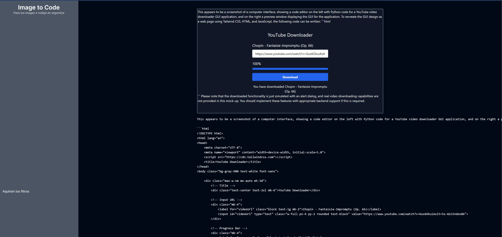
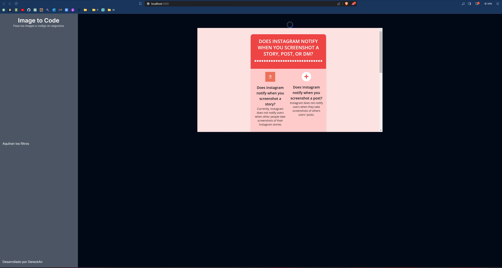

## :fountain_pen:  Images to Code with AI

This project came up because I need a way to create web components in a faster way and focus on other things. For this I was learning how to use the OpenAI API and how to send requests and receive information from the API. from the API. My focus was to use the API but in the future I will take care of making the site more presentable. And with more functionalities.

## My Role

:hammer_and_wrench: Responsabilities:

- Implement the logic of each game
- Build the mobile app
- Find a way to adapt the games to be multiplayer

<!-- :satellite: Technologies -->

## The Project

:mag_right: Challenges:

- 

:moneybag: Outcome:

- 

